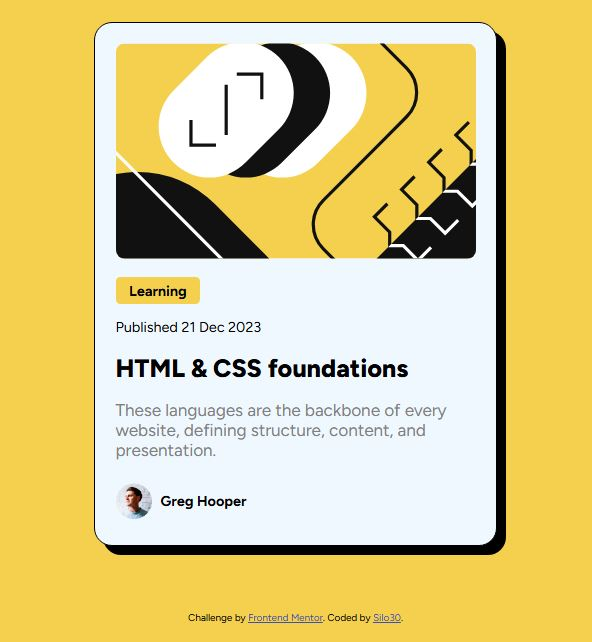

# Frontend Mentor - Blog preview card solution

Esta é a minha solução para o desafio ["Blog preview card"](https://www.frontendmentor.io/challenges/blog-preview-card-ckPaj01IcS) na plataforma [Frontend Mentor](https://www.frontendmentor.io/home). Os desafios da Frontend Mentor ajudam você a melhorar suas habilidades de código ao construir projetos realistas.

## Tabela de conteúdo

- [Visão Geral](#visão-geral)
  - [O Desafio](#o-desafio)
  - [Screenshot](#screenshot)
  - [Links](#links)
- [Meu procesos](#meu-processo)
  - [Feito com](#feito-com)
  - [O que eu aprendi](#o-que-eu-aprendi)
  - [Recursos Úteis](#recursos-úteis)
- [Autor](#autor)

## Visão Geral

### O Desafio

O desafio involve criar uma página que mostra um cartão prévia de um blog. Deve conter um elemento interativo quando o usuário pairar o mouse sobre ele.

### Screenshot



### Links

- Link da solução na Frontend Mentor: [Add solution URL here](https://your-solution-url.com)
- Link para a ver o site: [Add live site URL here](https://your-live-site-url.com)

## Meu processo

### Feito com

- Semantic HTML5 markup
- CSS custom properties
- Flexbox
- Hover effect

### O que eu aprendi

Não tinha feito uso da propriedade box-shadow antes. Me surpreendi com o quão simples é de se usar. Estou ansioso para usar novamente em futuros projetos. 
```css
.proud-of-this-css {
  box-shadow: 10px 10px;
}
```
Levei um pouco de tempo para fazer o hover funcionar corretamente, mas agora estou confiante que dominei esta propriedade.
```css
h1:hover {
    color: hsl(47, 88%, 63%);
}
```

### Recursos Úteis

- [Google Fonts](https://fonts.google.com/) - Forneceu a fonte usada no desafio que me permitiu deixar a versão final mais parecida com o design desejado no desafio.

## Autor

- LinkedIn - [Silo de Menezes](www.linkedin.com/in/silo-menezes-648920197)
- Frontend Mentor - [Silo30](https://www.frontendmentor.io/profile/Silo30)
- Github - [Silo30](https://github.com/Silo30)
